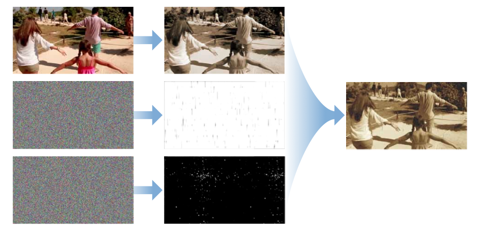
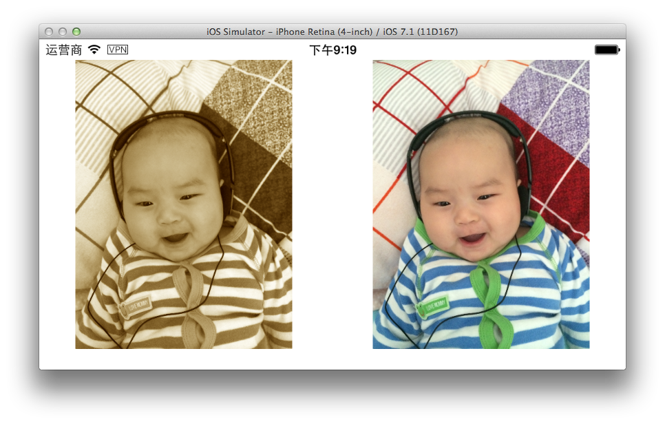
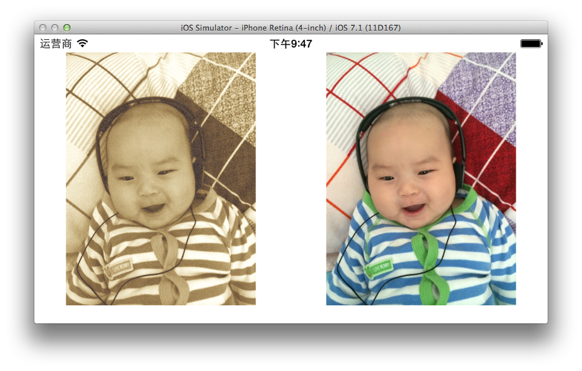
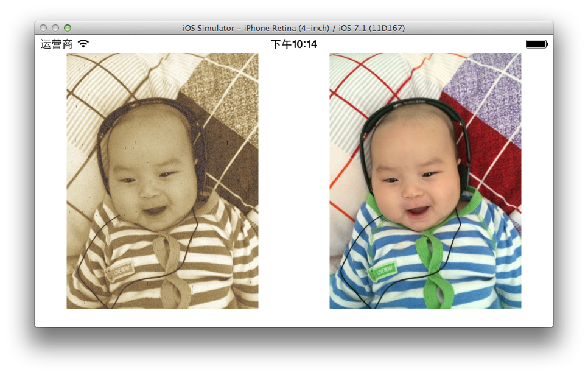

#下面是实现一个带燥点的旧胶片效果的处理流程

* 首先用 **CISepiaTone** 生成单色旧胶片的图像
* 然后生成一张白色燥点的遮罩图片
* 然后生成一张黑色划痕燥点的遮罩图片，来体现胶片磨损的效果
* 最后把三张图片合成在一起

### 首先来单色照片
	
	CIFilter *sepiaToneFilter = [CIFilter filterWithName:@"CISepiaTone"];
	[sepiaToneFilter setValue:myImage forKey:kCIInputImageKey];

### 生成白色燥点遮罩然后跟单色的照片合成在一起

	CIFilter *randomFilter = [CIFilter filterWithName:@"CIRandomGenerator"];
	CIFilter *colorFilter = [CIFilter filterWithName:@"CIColorMatrix"];
	[colorFilter setValue:randomFilter.outputImage	forKey:kCIInputImageKey];
	CIVector *vector = [CIVector vectorWithX:0 Y:1 Z:0 W:0];
	[colorFilter setValue:vector forKey:@"inputRVector"];
	[colorFilter setValue:vector forKey:@"inputGVector"];
	[colorFilter setValue:vector forKey:@"inputBVector"];
	[colorFilter setValue:[CIVector vectorWithX:0 Y:0 Z:0 W:0.1] forKey:@"inputAVector"];
	CIFilter *compositingFilter = [CIFilter filterWithName:@"CIAdditionCompositing"];
	[compositingFilter setValue:colorFilter.outputImage	forKey:kCIInputImageKey];
	[compositingFilter setValue:sepiaToneFilter.outputImage	forKey:kCIInputBackgroundImageKey];

### 生成黑色划痕遮罩 然后在合成在一起

	CIImage *maskImage = [randomFilter.outputImage imageByApplyingTransform:CGAffineTransformMakeScale(10, 45)];
	CIFilter *colorFilter2 = [CIFilter filterWithName:@"CIColorMatrix"];
	[colorFilter2 setValue:maskImage forKey:kCIInputImageKey];
	CIVector *vector2 = [CIVector vectorWithX:0 Y:0 Z:0 W:0];
	[colorFilter2 setValue:[CIVector vectorWithX:6 Y:0 Z:0 W:0] forKey:@"inputRVector"];
	[colorFilter2 setValue:vector2 forKey:@"inputGVector"];
	[colorFilter2 setValue:vector2 forKey:@"inputBVector"];
	[colorFilter2 setValue:vector2 forKey:@"inputAVector"];
	[colorFilter2 setValue:[CIVector vectorWithX:0 Y:1 Z:1 W:1] forKey:@"inputBiasVector"];
	CIFilter *blackFilter = [CIFilter filterWithName:@"CIMinimumComponent"];
	[blackFilter setValue:colorFilter2.outputImage forKey:kCIInputImageKey];
	CIFilter *compositingFilter2 = [CIFilter filterWithName:@"CIMultiplyCompositing"];
	[compositingFilter2 setValue:blackFilter.outputImage	forKey:kCIInputImageKey];
	[compositingFilter2 setValue:compositingFilter.outputImage	forKey:kCIInputBackgroundImageKey];

