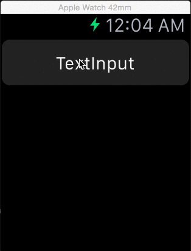
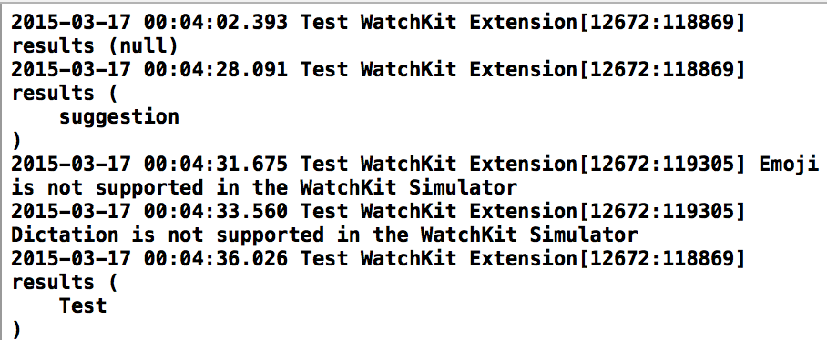

# Apple Watch 中的文本输入
在 Apple Watch 上文本输入的交互主要是通過 **Emoji** 和 **听写** 两种方式。在现有的**Watch Kit**中苹果提供了一个现成的 API 来实现这个功能



-(void)presentTextInputControllerWithSuggestions:(NSArray *)suggestions 
								 allowedInputMode:(WKTextInputMode)inputMode 
								  	   completion:(void (^)(NSArray *results))completion



我们可以通过 `suggestions` 来指定一些默认的输入文本内容。
`WKTextInputMode ` 定义了三种输入模式

1. `WKTextInputModePlain`  只能输入建议的默认文本和听写的内用 
2. `WKTextInputModeAllowEmoji` 允许建议的文本 听写 和 没有动画的 Emoji
3. `WKTextInputModeAllowAnimatedEmoji` 建议的文本 听写 没有动画的 Emoji 和 带动画的 Emoji。

这个方法是异步的，调用后会在下一个 `runloop` 开始执行。当用户输入完成或者通过 `- (void)dismissTextInputController` 取消输入后，   会通过`completion` 回调回来，通过`results`数组我们就可以得到用户的输入内容，有可能是 `NSString` 或者 Emoji 。带动画的Emoji 可能是以 `NSData`的形式返回给我们，我们需要自己在 Watch extension 中把他绘制成相应的 `UIImage`对象来使用。

[API的相关文档](https://developer.apple.com/library/prerelease/ios/documentation/WatchKit/Reference/WKInterfaceController_class/index.html#//apple_ref/doc/uid/TP40014957-CH1-SW28)

 

-(IBAction)textInputButtonPressed {
[self presentTextInputControllerWithSuggestions:@[@"suggestion",@"Test",@"Input"]
   								allowedInputMode:WKTextInputModeAllowAnimatedEmoji
									  completion:^(NSArray *results) {
											 NSLog(@"results %@",results);
									  }];
}



目前在模拟器上 听写和Emoji 还无法正常的使用，等到真机在测试吧。